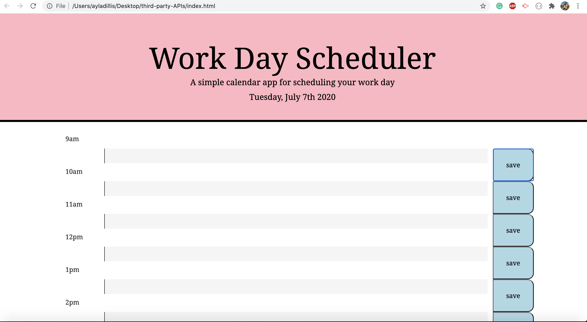
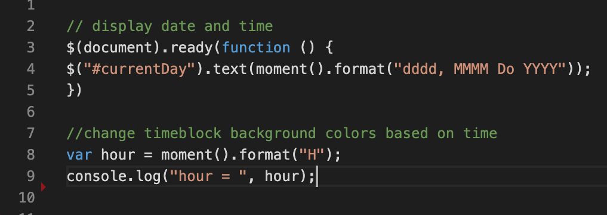
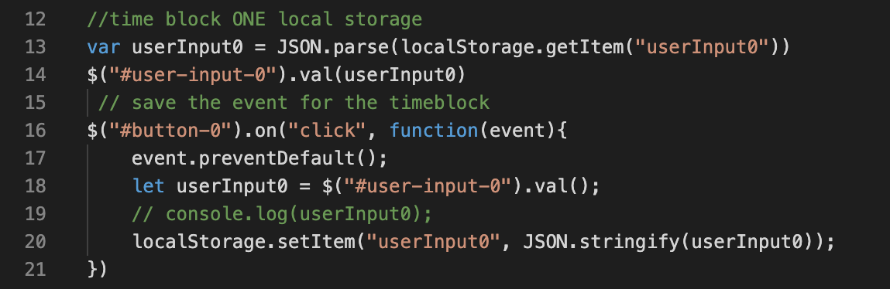

# Third-Party-APIs-Day-Planner

The Day Planner implements JQuery in javascript, saving text to local stroage and then pulling it back out of local storage when the browser is refreshed.




## Table of Content
- Objective
- Deploy Link
- Getting Started
- Code Highlights
- Author 

## Objective 
Build a day planner for an eight hour work day that displays the current date and time at the top of the page. Attach a save button next to each text box to save hourly memos into local storage as well as create a function that changes the text box color depending on what time it is; gray for the past, red present and green for future. Add unique styling! 

## Deploy Link 

* [See Live Link](https://ayladillis.github.io/third-party-APIs/)

## Getting Started
These instructions will get you a copy of the project up and running on your local machine for development and testing purposes. See deployment for notes on how to deploy the project on a live system.

```
$ git clone git@github.com:ayladillis/third-party-APIs.git
third-party-APIs.git
$ cd third-party-APIs.git
```
Then open in your preferred text editor:
- [vim](https://www.vim.org/) 
- [emmacs](https://www.gnu.org/software/emacs/)
- [visual studio code](https://code.visualstudio.com/) 

## Code Highlights





## Technology
* [HTML](https://developer.mozilla.org/en-US/docs/Web/HTML)
* [CSS](https://developer.mozilla.org/en-US/docs/Web/CSS)
* [Javascript](https://developer.mozilla.org/en-US/docs/Web/JavaScrip)
* [JQuery](https://jquery.com/)


## Authors 
- [Ayla Dillis](https://github.com/ayladillis)
