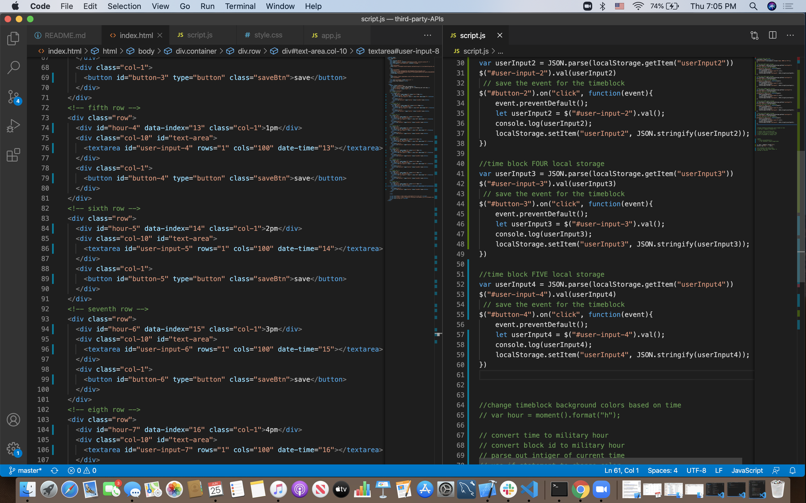

# Third-Party-APIs
Third party API's homework 05

This assignment focused on implementing JQuery into javascript, saving text to local stroage and then pulling it back out of local storage when the browser was refreshed. And using a dinamic time element to change the color of timeblocks depending on if they were in the past, present or future. 

## Tools
* Zoom
* Slack
* GitHub
* GitLab
* BootCamp Code Drills
* Slack Overflow
* Google
* Youtube
* w3School
* MDN Webdocs
* Ramon Sanchez (my tutor)
* my peers (shout-out Bart, Mai, Isaias, Seyoung and Joel!)

## Code Snippets

* I did not get this segment of the code working however I would still like to feature it here, I tried multiple ways to get the if/else statement to change the text box background colors and I'm still not sure the problem is. Although I can see the exact line of code where I went wrong using the inspect and HTML validator I'm just not sure how to fix it, frustrating but thats how I know I'm learning! 

//change timeblock background colors based on time
var hour = moment().format("H");
console.log("hour = ", hour);
var dataIndex = document.getElementById("data-index")

var changeTimeBlockColor = function(){
if ( dataIndex = hour){
userInput0.style$("#present");
}else{
    dataIndex < hour.style$("#future");
}
return changeTimeBlockColor;
};

* Local storage is something I really struggled with the last homework so I'm really appriciative my tutor was able to help me figure it out this time! Although my code is not very dry the next time I code something like this I will set up my contianers in Javascript not HTML so there is less redundency 

time block ONE local storage 
var userInput0 = JSON.parse(localStorage.getItem("userInput0"))
$("#user-input-0").val(userInput0)
 // save the event for the timeblock 
$("#button-0").on("click", function(event){
    event.preventDefault();
    let userInput0 = $("#user-input-0").val();
    // console.log(userInput0);
    localStorage.setItem("userInput0", JSON.stringify(userInput0));
}) 

## Screenshots

* This image is from when I was setting up my local storage. 

## Deploy Link 

* [See Live Link](https://ayladillis.github.io/third-party-APIs/)

## Authors 

Ayla Dillis

* [HTML](https://developer.mozilla.org/en-US/docs/Web/HTML)
* [CSS](https://developer.mozilla.org/en-US/docs/Web/CSS)
* [Javascript](https://developer.mozilla.org/en-US/docs/Web/JavaScrip)
* [JQuery](https://jquery.com/)

